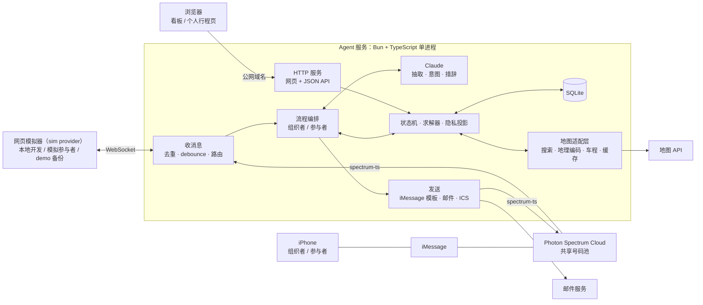

# AI Event Planner — Hackathon Plan（Photon · Agents in iMessage）

版本：v0.2 · 日期：2026-09-25 · 依据：[basic-structure-prd.md](./basic-structure-prd.md) v0.1、`Hackathon Guideline - Photon.pdf`、Spectrum 文档（photon.codes/docs，2026-09 读取）。

v0.2 变更：加回 Web 前端（组织者看板 + 个人行程页）、邮件（批准后的个性化邮件和日历邀请）、地图 API（地点搜索、集合点地理编码、车程矩阵）。

本文是 hackathon 期间的唯一执行依据。PRD 保留为长期产品基线；hackathon 期间两者冲突时以本文为准。原则是：**只做 demo 需要的东西，生产级能力一律不做。**

## 0. 一句话与核心决策

**一句话**：一个住在 iMessage 里的活动协调 agent。组织者私聊它一句话，它分别私聊每个人收集时间、预算、忌口和接送需求，结合地图数据用确定性求解器排出方案。组织者在聊天里批准后，每个人都会收到自己的安排：iMessage 里是要点和链接，网页上是带地图的完整行程，邮箱里是日历邀请。之后谁变卦，它只找受影响的人重新协调。

**Pitch**：*"Juno is the friend who actually organizes the plan. It lives in iMessage, talks to everyone privately, and never sends anything until the organizer says go."*（Juno 是工作名，可换）

**核心决策**

1. **iMessage 是主界面，网页和邮件做辅助**。所有对话和决定都在 iMessage 里完成，通过 Spectrum 的 `spectrum-ts` 云端 iMessage provider 收发；集成 Spectrum 本身就是参赛资格要求。网页只读，负责展示地图、时间线和进度；邮件负责把日历邀请送进每个人的日历。
2. **私聊优先（hub-and-spoke）**。promo code 给的是 Pro 套餐，走共享号码池：不能建群，也收不到群事件（见 §3.1）。所以核心流程只依赖一对一私聊，群聊作为有条件的加分项。
3. **LLM 负责理解和表达，代码负责判断和执行**（继承 PRD 原则 3）。时间、预算、座位、过敏由确定性代码判定；只有组织者明确批准，才会发最终安排。
4. **接真实地图数据，demo 跑缓存**。地图 API 负责地点搜索、集合点地理编码和车程矩阵；结果缓存在本机，demo 默认读缓存，不依赖现场网络。服务是 Bun 单进程 + SQLite，同时承担 iMessage agent、网页和 API。
5. **Demo 用真人真机**。4 部 iPhone 全部提前登记为 Spectrum 项目的 Users，大屏同时显示组织者看板；网页模拟器和录屏做备份。

## 1. 评审标准 → 我们的回应

| 评审点 | 我们怎么做 | 出现在 |
|---|---|---|
| 真实的人机协作，不是 prompt 演示 | 4 个真人各用自己的手机；每人确认自己的约束；排除谁、选哪个方案、谁当替补司机，都由人拍板 | 幕 2–4 |
| 上下文跨时间、渠道、队友延续 | 按 iMessage 号码记住每个人；发布后有人变卦，agent 知道会影响谁；下次活动还记得 Sam 花生过敏，只请他确认一句 | 幕 4、pitch |
| 跨界面存在（赛道说明里的 "exist across interfaces"） | 同一个 agent、同一份状态：iMessage 里对话，网页上看全貌（地图、时间线），邮箱里收日历邀请 | 幕 2–3 |
| 让时刻更好，不抢注意力 | 连发的消息合并成一次回复；用 tapback 代替"收到"；只通知受影响的人；最多提醒一次 | 全程 |
| 安全与回退赢得信任 | 未批准不发送；硬约束绝不悄悄放宽；场地信息不确定就标出来让人核实；敏感信息只在私聊出现；LLM 出错就退回简单选项 | 幕 3 |
| Vision：hybrid intelligence | 人负责取舍（谁必须来、什么值得妥协），agent 负责跑腿和组合计算 | pitch |
| Craft：完整、responsive、有品味 | 处理时立即显示 typing；用 iMessage 原生能力（tapback、特效、链接预览、联系人卡片）；看板实时更新 | 全程 |
| Depth：真实语境与边界情况 | 预算冲突给备选；地图数据里没有过敏信息，只能人工核实；司机临时退出；有人不回复 | 幕 3–4 |
| Traction：明天就能给真实用户用 | 不装 App、不注册、不填表，给一个号码发消息就行；日历邀请能一键加入常用日历；hackathon 期间真用它组织一次团队聚餐 | pitch |
| 必须集成 Spectrum | `spectrum-ts` 是唯一的消息收发层：iMessage provider，加上我们用 `definePlatform` 自己写的网页模拟器 provider | 全程 |

## 2. 相对 PRD 的取舍

### 2.1 保留（成本低，直接对应评审点）

- **未批准不发送**（PRD 原则 2）：收集、求解、修改都不会给参与者发最终安排，iMessage 和邮件都一样。只有组织者发出明确的 `approve`，最终安排才会发出；tapback 不算批准。
- **LLM 提议，代码判定**（原则 3）：模型抽取出的字段先作为"提议"，复述给本人确认后才生效。求解和校验都是纯函数。
- **硬约束不放宽，未知要说出来**（原则 4）：违反过敏、个人预算上限、座位数或最晚到家时间的方案一律不可行。场地事实分 `SUPPORTED / UNSUPPORTED / UNKNOWN` 三种；只要有 `UNKNOWN`，方案就不能批准，直到组织者核实。
- **隐私最小化**（原则 6）：预算数字、过敏细节、住址只在本人私聊里出现。组织者默认只看聚合信息，只有需要他决策的冲突才展开到个人。
- **方案绑定版本**（F28 简化）：任何输入变化都让旧方案作废，旧方案不能被批准。
- **排除要有理由**：方案里被排除的人逐个写明原因类别；组织者批准即视为确认排除名单。
- **拼车规则**：乘客座位数不含司机；每个需要接送的人每一程恰好坐一辆车；只有本人愿意，才会被安排开车。
- **费用上界**：每人费用按保守上界计算，和本人的预算硬上限比较。

### 2.2 改变做法

| PRD | Hackathon 版 |
|---|---|
| 响应式 Web：Planner 工作台、Attendee 对话页、个人行程页 | 精简 Web：组织者看板（进度、方案、地图，只读）+ 个人行程页；对话和决定都留在 iMessage |
| 公开收集链接 | 组织者把名字或联系人卡片交给 agent，agent 主动私聊每个人（demo 预置"名字→号码"通讯录） |
| 邮箱验证、magic link、会话 token | iMessage 发送者的号码或邮箱就是身份；网页通过 agent 私聊发出的不可猜链接进入，不做登录 |
| 个性化邮件 + ICS | 保留，邮箱改为可选：批准后给留了邮箱的人发个性化邮件 + 日历邀请；iMessage 里发要点和行程页链接 |
| 地点检索、地理编码、路线矩阵 | 保留：地图 API 做地点搜索、集合点地理编码、车程矩阵；结果缓存，demo 读缓存 |
| 收集工作台 | 组织者看板实时显示进度 |
| 7 个 Event 状态 + revisionState | 4 个状态（§5.9） |
| 异步 job、outbox、租约 | 单进程顺序处理，按 `message.id` 去重 |
| 邮件投递状态机（已接收、已送达、退信） | 只记录发送成功或失败 |
| 人工核实 UI | 组织者在私聊里说"打过电话了，可以"，系统记录来源和时间 |

### 2.3 明确不做

账号与登录、网页上的写操作（创建、修改、批准都在 iMessage 里做）、第三方点评或菜单数据（过敏信息只靠人工核实）、邮件退信与送达回执、日历邀请的 RSVP 回复处理、实时路况、订座订票、支付与 AA、多日或跨城行程、无障碍信息、活动偏好排序、中途退出可选环节、油费分摊、整场取消、删除本人数据、时区与夏令时边界、多币种、50 人规模与性能指标、备份恢复、监控审计、限流与成本配额、数据保留策略、生产级部署运维、OpenAPI 契约、产品指标。

### 2.4 PRD Feature 对照

| PRD Feature | Hackathon 处理 |
|---|---|
| F01–F04 创建、对话、澄清、摘要确认 | 保留，改为组织者私聊 |
| F05 Planner 验证恢复 | 不做登录：网页用 token 链接，链接只通过本人的私聊发出 |
| F06–F08 发布分享、收集工作台、关闭收集 | 简化：agent 私聊邀请；组织者看板显示进度；全员确认或组织者说 `plan it` 后开始求解 |
| F09–F11 参与者入口、对话、回答结构化 | 保留，改为参与者私聊 |
| F12–F15 时间、预算、饮食/过敏、车辆接送 | 保留，简化为单日、单币种、往返同一车组；集合点经地理编码后由本人确认 |
| F16 活动偏好 | 不做（活动由组织者定） |
| F17–F18 提交去重、修改 | 保留：按号码去重；确认摘要即提交；随时可改 |
| F19–F20 地点候选、路线 | 保留：地图 API（地点搜索、地理编码、车程矩阵），结果缓存 |
| F21–F25 求解与冲突 | 保留，改为小规模穷举 |
| F26–F27 报告、修订重算 | 保留：iMessage 方案消息 + 看板上的方案视图（地图、时间线）；修改在 iMessage 里说 |
| F28–F29 版本、授权 | 保留，简化为整数版本号 + 明确批准 |
| F30–F32 个性化通知、发送重试、日历 | 保留：iMessage 通知 + 个性化邮件（日历邀请）；发送失败时告诉组织者，不自动重试 |
| F33 个人行程页 | 保留：地图、时间线、同车人、加入日历 |
| F34 发布后变更 | 保留（demo 高潮）；iMessage、邮件、网页同步更新 |
| F35 整场取消 | 不做 |
| F36 权限与隐私 | 简化为 §5.11 的规则 |
| F37–F40、F43–F46 异步任务、监控、限流、删除、自动化验收、部署、契约、指标 | 不做，只保留求解器单元测试 |
| F41 移动与可访问性 | 简化：网页保证在手机上好用（多数人从 iMessage 点开）；不做完整无障碍审计 |
| F42 降级与恢复 | 简化：LLM 出错就退回模板问题；地图 API 出错就读缓存；网页模拟器做 demo 备份 |
| F47 候选人工核实 | 简化：组织者在私聊里确认 |
| F48 交付与测试数据 | 保留：地图缓存、种子数据、重置脚本、demo 脚本 |

## 3. 外部约束（决定了架构）

### 3.1 Spectrum

| 事实（来自 Spectrum 文档） | 对我们的影响 |
|---|---|
| Pro 套餐走**共享号码池**：不能建群，收不到加人、退群、改名等群事件。agent 能否在别人建的群里收发普通消息，文档没写明 | 核心流程只用私聊；群聊层等 Day-0 验证（§9） |
| 共享池里，不同用户看到的 agent 号码可能不同 | 不能让大家把"同一个号码"拉进群；邀请由 agent 主动私聊 |
| 共享池只能给登记在项目 Users 里的号码发消息，否则报 `Target not allowed for this project` | demo 手机提前登记；用 debug.photon.codes 查出每部手机真实的 iMessage handle |
| 每条线每天最多 50 个新会话；每个服务每天最多 5,000 条消息 | demo 够用；日常测试尽量用网页模拟器 |
| Apple 按行为过滤：陌生号码的消息会带 "Report Junk"；首条别带链接或媒体；追问不超过 2–3 次；别在深夜发；用户发满 3 条后，会话被视为可信 | 开场白用纯文本问句，并提到组织者的名字；链接只在对方回复过之后发；催促最多一次；聊过几句后再发联系人卡片 |
| 人会连发多条消息（Photon 最佳实践） | 每个会话做 debounce，合并成一轮再回复 |
| 没有历史消息 API | 对话记录自己存 |
| `space.responding()` 自动显示 typing；另有 tapback、线程回复、编辑、撤回、特效、附件、投票、联系人卡片 | 用来做 responsive 和"不打扰" |
| 已发消息可以编辑（Apple 限制 15 分钟内最多 5 次）；iMessage 上的流式输出靠反复编辑实现 | 进度消息原地更新，超出窗口就发新消息；回复不走流式 |
| App card 需要接收者先装 Spectrum iMessage App。普通链接可以用 `richlink()` 发，由 iMessage 原生渲染预览（Spectrum 只传 URL，预览内容来自页面自己的 OG 标签） | 网页链接用 `richlink()` 发，页面配好 OG 标题和地图预览图；App card 放进"有余力再做" |
| 已读回执只在私聊可靠，而且要对方开启"发送已读回执" | 不用已读做任何逻辑 |
| 用户可能在 SMS/RCS 上（看 `sender.service`） | 对这些用户只发纯文本，链接也是纯文本 |
| 可以用 `definePlatform` 自定义平台，和内置 provider 一样注册；terminal provider 零配置 | 网页模拟器做成自定义的 `sim` provider，和 iMessage 同时注册、消息汇进同一条流，真手机和模拟的人能在同一场活动里互相邀请。terminal 留作备用 |

### 3.2 地图、邮件与公网访问

| 事实 | 对我们的影响 |
|---|---|
| Google Maps Platform 要绑定结算账户才能用 | Day-0 建项目、开通 API、拿到 key |
| 地图 key 分服务端和浏览器两种；浏览器 key 会出现在网页代码里 | 服务端 key 只放后端；浏览器 key 按域名限制 |
| 地图数据里没有过敏信息 | 过敏事实默认 `UNKNOWN`，只能人工核实；这正好是 demo 里"人来拍板"的时刻 |
| 地图服务商的条款一般限制缓存和存储它的数据 | 缓存只在本机、只在 hackathon 期间用，不进 git |
| 事务邮件服务要先验证发信域名（SPF/DKIM），才能发给任意收件人 | Day-0 验证域名；来不及就只发给团队自己的邮箱 |
| iMessage 链接、邮件链接和链接预览都要公网能访问 | 本机服务需要一个固定的公网域名（隧道或部署到云主机） |

## 4. 产品设计

### 4.1 角色

- **组织者**：私聊 agent 发起活动，并做所有决策。通常自己也参加，个人约束在同一个私聊里补答。
- **参与者**：在私聊里回答问题、确认摘要、收到个人安排，之后随时可以改。
- **司机**：参与者的属性，包括有没有车、有几个空座、愿不愿意开（`yes / if_needed / no`）。
- **Agent（Juno）**：说英文，也能理解中文输入。语气像靠谱的朋友：短句，不堆 emoji，不说客套话。
- **链接**：每个人都有一个只属于自己的网页链接，组织者的是看板，参与者的是个人行程页，都只通过本人的私聊发出。

### 4.2 Demo 场景

周六下午徒步 + 晚餐，5 个人。

| 人 | 设定 | 扮演 |
|---|---|---|
| Alex | 组织者，也参加；开车，2 个空座 | 队员 1 的手机 |
| Sam | 没车，在图书馆附近；3pm 以后有空，10pm 前要到家；**花生严重过敏** | 队员 2 的手机 |
| Priya | 开车，2 个空座，在 North Station 附近 | 队员 3 的手机 |
| Leo | 有车但不想开（`if_needed`），在 North Station 附近；**预算 ≤ $30** | 第 4 部手机（队员 3 兼任） |
| Mia | 没车，时间都行 | 模拟参与者：在网页模拟器（`/sim`）里扮演 |

地点数据来自地图 API，用 hackathon 所在区域的真实地点，提前抓取并缓存。下面的名字只是占位：

- 活动：Pine Ridge Trail（2 小时，免费）等 2–3 个候选。
- 餐厅 5–6 家：价格区间、营业时间、电话来自地图数据；过敏事实默认是 `UNKNOWN`。关键的两家：
  - **Maple Kitchen**：$22–30，对花生过敏是 `UNKNOWN`
  - **Olive Tree**：$30–38，无坚果厨房（`SUPPORTED`）。这类事实必须由团队按店家公开信息或电话核实后录入，并注明来源；绝不编造真实商家的信息。
- 集合点：图书馆、North Station、Campus Gate，都是地理编码后的公共地点，不用住址。
- 车程：集合点和候选地点之间的车程矩阵。

这样设计是为了触发几个冲突：Maple Kitchen 人人付得起，但过敏情况未知；Olive Tree 过敏安全，但超出 Leo 的预算。Priya 退出后，只剩 Alex 的 2 个空座，而要搭车的人有 4 个，必须请 Leo 开车。

### 4.3 主流程与示例对话

**流程 1 · 组织者发起**（Alex 私聊）

```text
Alex: can you plan a hike + dinner this saturday afternoon near campus? 5 of us, max $40 each
Juno: On it. What window works on Saturday — say 2 to 10 PM?
Alex: yeah 2-10
Juno: Here's the plan so far:
      • Sat 2–10 PM · hike + dinner near campus · 5 people
      • Up to $40 per person (hard cap)
      I'll message each person privately about their time, budget, food allergies and rides.
      Sound right?
Alex: [对这条消息点 👍 tapback]
Juno: Who's coming? Share their contacts or just type names.
Alex: sam, priya, leo, mia. I'm in too and can drive 2
Juno: Got it. Texting them now — you can watch replies come in here:
      [看板链接，iMessage 里显示为链接预览]
```

- 一次只问一个真正影响决策的问题。
- 摘要可以用 👍 tapback 确认。确认后，后台按区域搜索候选活动和餐厅（demo 读缓存）。
- 可以分享联系人卡片（收到的内容类型是 `contact`），也可以直接打名字（demo 查预置通讯录）。
- 看板链接只发给组织者。这时组织者已经回复过好几条，链接可以正常点开（Apple 只在对方回复之前限制链接）。
- 组织者自己的其他约束随后在同一个私聊里补问。

**流程 2 · 参与者私聊**（Sam）

```text
Juno: Hi Sam, it's Juno — Alex is putting together a hike + dinner this Saturday
      afternoon and asked me to find a time that works for everyone. Got a sec
      for 4 quick questions?
Sam:  sure
Juno: What part of Saturday 2–10 PM are you free?
Sam:  after 3
Sam:  need to be home by 10 though          ← 连发的两条合并成一轮处理
Juno: Any food allergies or things you don't eat?
Sam:  peanuts, pretty severe
Juno: Thanks — I'll treat that as a must, not a preference. Do you drive, or need
      a ride? (Only your car group will see your name and pickup spot.)
Sam:  need a ride, I'm near the library
Juno: Last one: Alex set $40/person as the max. Does that work for you?
Sam:  yeah
Juno: Here's what I've got:
      • Free Sat 3–10 PM, home by 10
      • Severe peanut allergy
      • Needs a ride, pickup at Main Library (north entrance)
      • Budget up to $40
      Right? You can change anything anytime.
Sam:  yep
Juno: [对 "yep" 点 ❤️ tapback] Want the calendar invite by email too? Send your
      email, or just say skip.
Sam:  sam.lee@example.com
Juno: Perfect. I'll text you as soon as the plan is set.
```

- 开场白是纯文本，提到组织者名字，并以问句结尾（符合 deliverability 规则）。
- 已经回答过的不再问。一条消息里说了多件事，就一次全部抽取。
- "the library" 由 Claude 抽成地点描述，代码在活动区域内做地理编码，把标准名字写进摘要让本人确认。
- 摘要用代码模板生成，保证和存下的数据一字不差；确认后才进入求解。
- 邮箱可选，不给也能正常参加。

**流程 3 · 进度与方案**（Alex 私聊 + 看板）

进度：大屏上的看板实时显示谁确认了、集合点落在地图哪里。有余力时，iMessage 里再加一条原地更新的进度消息：`3 of 5 ready · waiting on Priya and Leo` → `All 5 ready. Putting the plan together…`

```text
Juno: Plan A works for all 5:
      • 3:05 PM pickups (2 cars) · you → Mia · Priya → Sam, Leo
      • 3:45–5:45 Pine Ridge Trail (free)
      • 6:30 Maple Kitchen (~$22–30 per person)
      • Everyone home by 8:45
      ⚠️ One thing I can't confirm: whether Maple Kitchen can handle a severe
      peanut allergy. Could you give them a call? 555-0142
      Plan B: Olive Tree has a nut-free kitchen, but it's up to $38 per person —
      Leo would have to sit this one out (over his budget).
      Map and full plan: [看板链接]
      Reply "approve A" once it's confirmed, or tell me what to change.
Alex: just called, they said they can do it
Juno: Noted — confirmed by you by phone at 7:12 PM. Plan A is ready.
      Reply "approve A" and I'll send everyone their details.
Alex: approve A
Juno: Sent to all 5 🎉
```

- 看板同时切到方案视图：地图上画出两辆车的接人路线，下面是时间线和未知项。
- 餐厅电话来自地图数据。
- 组织者可以用自然语言修改（"can we start at 4?"）。代码重算后版本号 +1，旧方案作废。
- 组织者能看到被排除的人和原因类别，看不到具体预算数字。
- 批准只认组织者发的、针对当前版本的明确文字。

**流程 4 · 个人通知**（每人内容不同）

```text
Juno → Sam:   [confetti 特效] You're all set for Saturday 🎉
              • 3:05 PM — Priya picks you up at Main Library
              • 3:45 Pine Ridge Trail
              • 6:30 Maple Kitchen — Alex confirmed with them that they can
                handle your peanut allergy
              • Your cost: up to $30
              • Back at the library by ~8:40
              Map and details: [个人行程页链接]
邮件 → Sam:    "Saturday: hike + dinner — your plan"：同样的要点 + 集合点地图，附日历邀请
Juno → Priya: You're driving: 3:05 PM Main Library (Sam) → 3:15 North Station (Leo) → trailhead …
```

- 个人行程页：自己的集合点和路线地图、时间线、同车人名字、费用上界、"加入日历"按钮。
- 模拟参与者 Mia 的消息显示在网页模拟器里。

**流程 5 · 发布后变更**（demo 高潮）

```text
Priya:       ugh my car's in the shop, can't drive tomorrow
Juno→Priya:  Thanks for the heads-up. Still want to come? I can get you picked
             up near North Station.
Priya:       yes please
Juno→Leo:    Hey Leo — Priya's car fell through for tomorrow. You mentioned you
             could drive if needed: could you take Sam and Priya? It's about
             10 extra minutes.
Leo:         sure, happy to
Juno→Alex:   Change for Saturday: Priya can't drive, and Leo agreed to take Sam
             and Priya. Everything else stays the same — you and Mia aren't
             affected. Reply "approve" to send the update to the 3 people affected.
Alex:        approve
Juno→Sam/Priya/Leo: 新的个人安排；邮件里的日历邀请随之更新（同一个 UID，原事件直接改）；
                    行程页标出 "Updated" 和改了什么。Mia 和 Alex 什么都不会收到。
```

这一幕展示四件事：
- agent 记得 Leo 之前说过"必要时可以开"；
- 要别人让步之前，先私聊征得本人同意；
- 组织者批准后才发送；
- 只打扰受影响的人。

同时，看板上的路线换成 Leo 的车，版本号从 v1 变成 v2。

### 4.4 Agent 行为准则

1. 一次只问一个问题；已经回答过的不再问。
2. 连发的消息合并处理，只回复一次。
3. 不需要回复的消息（"thanks"、"ok"）用 tapback 回应，不再另发一条。
4. 一条消息只说一件事；方案类内容用短列表。
5. 需要别人同意的事，先私聊问本人，再告诉组织者；从不替任何人答应任何事。
6. 场地信息不确定就直说不确定，并说明怎么确认；绝不编造。
7. 催回复最多一次；晚上 10 点到早上 8 点不主动发消息（demo 时可关）。
8. 不向组织者或其他参与者透露任何人的预算数字、过敏细节或住址，只说组织者决策必需的最少信息。
9. 只有组织者发出 `approve`，才发最终安排；iMessage 和邮件都一样。
10. 链接只发给本人，而且只在对方回复过之后才发；网页只读，所有决定都在 iMessage 里做。

### 4.5 群聊层（有条件，见 §9 第 1、2 项）

只有在 Day-0 验证 Pro 线路能在群里收发消息，或拿到 dedicated line 之后才做：

- 组织者把 agent 加进朋友们原有的群聊。agent 只在被点名或组织者要求时说话。
- 群里只发公开内容：活动摘要、一个投票（比如晚饭选哪家）、最终的公开行程。
- 个人问题一律转到私聊："I'll message each of you privately about budget and food."
- 有人在群里主动说了敏感信息，agent 会记下，但只在私聊里确认。

## 5. 技术方案

### 5.1 架构



### 5.2 技术栈与目录

- **Runtime**：Bun + TypeScript 5。云端 iMessage 传输需要 Node 兼容运行时，不支持 edge worker。demo 时在一台笔记本上跑，用隧道（Cloudflare Tunnel 或 ngrok）给它一个固定的公网域名；也可以整个部署到云主机。
- **Spectrum**：`spectrum-ts`，使用 `imessage` provider 和自定义的 `sim` provider（网页模拟器，`/sim`），`terminal` 留作备用，用环境变量 `PROVIDERS` 选择启用哪些。用长连接的 `app.messages` 循环，Spectrum 本身不需要 webhook；公网域名是给网页和邮件里的链接用的。
- **Web**：同一个进程里用 Hono 提供 JSON API 和前端静态文件。前端用 Vite + React（或团队熟悉的框架），每 2–3 秒轮询刷新，不做 WebSocket。
- **地图**：推荐 Google Maps Platform：
  - Places API (New)：搜候选地点，拿价格、营业时间、电话、坐标；集合点（"图书馆附近"）也用它的 Text Search 在活动区域内找地标，Geocoding API 可以不开；
  - Routes API 的 `computeRouteMatrix`：算车程矩阵；
  - Maps JavaScript API：网页地图；Maps Static API：链接预览图和邮件里的地图。

  备选 Mapbox；选它之前先确认能拿到餐厅的价格和营业时间。
- **邮件**：事务邮件 API（Resend、Postmark 之类，Day-0 定）；HTML 邮件模板；日历邀请是 `METHOD:REQUEST` 的 ICS。
- **LLM**：`@anthropic-ai/sdk` + `zod`，模型 `claude-opus-5`（用法见 §5.4）。
- **存储与其他**：存储用 `bun:sqlite`；ICS 手写字符串生成；测试用 `bun test`。
- **环境变量**：见 `.env.example`。主要有 `PROVIDERS=imessage,sim`、`SPECTRUM_PROJECT_ID`、`SPECTRUM_PROJECT_SECRET`、`ANTHROPIC_API_KEY`（`LLM=off` 时不调模型）、`MAPS_MODE=sample|cache|live`（`sample` 是离线开发用的虚构数据）、`MAPS_SERVER_KEY`、`MAPS_BROWSER_KEY`、`MAPS_REGION`、`EMAIL_DRIVER`、`EMAIL_FROM`、`PUBLIC_BASE_URL`。

```text
src/
  index.ts            启动 Spectrum 收消息循环和 HTTP 服务                     (B)
  io/pipeline.ts      过滤、去重、debounce、路由、typing、发送节奏                (B)
  out/imessage.ts     iMessage 文案模板、特效、链接预览                         (B)
  out/email.ts        邮件模板与发送                                        (A)
  out/ics.ts          ICS 生成（固定 UID，更新时 SEQUENCE+1）                  (A)
  api/routes.ts       网页用的 JSON API（按 token 取隐私投影后的数据）             (A)
  flows/organizer.ts  组织者流程                                           (B)
  flows/attendee.ts   参与者流程                                           (B)
  core/state.ts       状态机、版本号、批准检查、受影响名单                      (B)
  core/privacy.ts     每个角色能看到的字段                                    (B)
  core/solver.ts      求解器                                               (C)
  brain/extract.ts    Claude 调用、zod schema、回退                         (C)
  brain/prompts.ts    提示词                                               (C)
  maps/               地点搜索、地理编码、车程矩阵、缓存                         (C)
  sim/                网页模拟器：自定义 Spectrum 平台（sim provider）+ WebSocket 中转  (A)
  types.ts            共享类型（最先定，B 维护）
  db.ts               SQLite                                              (B)
web/                  看板、个人行程页、地图组件、网页模拟器（/sim）                  (A)
fixtures/             通讯录、种子数据；maps-cache/ 放地图缓存（不进 git）          (B / C)
scripts/              reset-demo.ts 清库并载入种子；fetch-maps.ts 抓 demo 区域数据  (B / C)
test/solver.test.ts   求解器不变量测试                                       (C)
```

### 5.3 消息管线

```ts
import { Spectrum } from "spectrum-ts";
import { imessage } from "spectrum-ts/providers/imessage";
import { terminal } from "spectrum-ts/providers/terminal";

// 凭证从 SPECTRUM_PROJECT_ID / SPECTRUM_PROJECT_SECRET 读取；实际代码按 PROVIDERS 决定启用哪些 provider
const app = await Spectrum({ providers: [imessage.config(), terminal.config()] });

for await (const [space, message] of app.messages) {
  if (message.direction === "outbound") continue;
  pipeline.enqueue(space, message);
}
```

`index.ts` 在同一个进程里再启动 HTTP 服务（网页和 API）。

1. **过滤**：`read`、`typing` 等非用户输入直接忽略。`reaction` 单独处理：👍 点在摘要上视为确认；有余力时，❓ 触发换个说法重新解释。
2. **去重**：`message.id` 处理过的就跳过。
3. **路由**：按 `message.sender.id`（号码或邮箱）找到这个人在哪个活动、是什么角色。陌生人收到一句简短的自我介绍。hackathon 版假设每人同时只有一个进行中的活动。
4. **Debounce**：每个会话约 3 秒内的新消息都会重置计时器，合并成一轮。消息在处理完之前一直留在数据库的待处理表里；生成期间又来了新消息，就丢弃这次结果，合并后重来。
5. **处理**：debounce 结束后，用 `space.responding(...)` 包住整个处理过程，自动显示 typing。
6. **发送**：多条消息之间隔 0.5–1 秒。通知多人时逐个发送，失败的记下来告诉组织者。

### 5.4 LLM 与代码的分工

| Claude 负责 | 代码负责 |
|---|---|
| 从自然语言抽取字段提议（zod schema） | 校验字段；把确认过的提议写入答案；维护还缺哪些字段 |
| 抽出地点描述（"near the library"） | 在活动区域内地理编码，把标准名字写进摘要让本人确认 |
| 判断意图：回答 / 确认 / 修改 / 提问 / 闲聊 | 决定下一步：问什么、何时求解、通知谁 |
| 提问和闲聊的措辞 | 摘要、方案、个人通知、邮件这类事实性内容用模板生成，保证和数据一致 |
| — | 求解、排序、硬约束判断、版本号 |
| — | 批准：只认组织者、只认当前版本、只认明确的 `approve` 文字 |

LLM 用法：

- **模型与延迟**：`claude-opus-5`。对话轮次用 `output_config.effort: "low"` 压延迟，第一天就实测。如果达不到"debounce 结束后几秒内出回复"，再由团队决定怎么调。
- **一次调用做完一轮**：用 `client.messages.parse()` + `zodOutputFormat(schema)`，一次返回 `{ intent, proposals, reply }`。`parsed_output` 为空，或 `stop_reason` 不是正常结束时，走模板回退。
- **上下文最小化**：每次只带角色、活动公开信息、这个人自己已确认的字段、缺失字段列表和最近 10 条消息。绝不带其他人的原始回答。这既是隐私要求，也是 Photon 最佳实践里的 per-resource memory scope。
- **其他设置**：固定的 system prompt 放在最前面并加 `cache_control`；开启 server-side refusal fallback（`fallbacks: "default"`，beta `server-side-fallback-2026-07-01`）；不用流式输出。

### 5.5 地图数据

- **用在哪**：
  1. 候选地点：组织者确认摘要后，按活动类型和区域搜索活动地点和餐厅，记下价格、营业时间、电话、坐标。
  2. 集合点：参与者描述的位置先由 Claude 抽出来，再在活动区域内地理编码，得到一个公共集合点，写进摘要让本人确认。
  3. 车程：集合点 × 候选地点的驾车时间矩阵，给求解器用。
  4. 展示：网页地图、iMessage 链接预览图、邮件里的静态地图。
- **缓存**：所有结果带抓取时间存进 `fixtures/maps-cache/`。`MAPS_MODE=cache`（demo 默认）只读缓存；`live` 缺什么就请求什么，并写回缓存。
- **规则**：
  - 车程拿不到就是未知，绝不当成 0 分钟；关键车程未知的方案不能批准（沿用 PRD）。
  - 地图数据只当候选依据：价格和营业时间是估计，过敏信息一律是 `UNKNOWN`，要人工核实。
  - 服务端 key 只在后端用；浏览器 key 按域名限制。
  - 地图服务商的条款一般限制缓存和存储它的数据（Google 对 Places 内容有明确限制）。缓存只在本机、只在 hackathon 期间用，不进 git；产品化前按条款改。

### 5.6 Web 前端

| 页面 | 给谁 | 内容 |
|---|---|---|
| `/o/:token` 看板 | 组织者 | 收集进度（谁确认了、还差谁）、集合点地图；出方案后显示时间线、车组路线、未知项和版本号。只读，提示"在 iMessage 里回复 approve A" |
| `/i/:token` 个人行程页 | 参与者 | 自己的时间线、集合点和路线地图、同车人名字、费用上界、"加入日历"；有变更时显示 Updated 和改了什么 |

- **进入方式**：token 是随机长串，每人一个，只通过本人的 iMessage 私聊和邮件发出。不做登录，也没有任何页面列出所有活动或所有人。
- **刷新**：每 2–3 秒轮询一次 JSON API。demo 时大屏开着组织者看板，观众能看到大家的回答实时出现。
- **链接预览**：页面带 OG 标签（活动标题 + 目的地静态地图）。链接可能被转发，所以预览里不放任何个人信息。
- **数据**：API 只返回经过隐私投影的数据（§5.11）。
- **手机优先**：多数人是从 iMessage 点开的。

### 5.7 邮件与日历

- **什么时候发**：只在组织者批准后发；变更时只发给受影响的人。收集阶段不发任何邮件。
- **发给谁**：留了邮箱的参与者（邮箱在私聊最后问一次，可以跳过）；组织者也收一封方案摘要。
- **内容**：个性化 HTML 邮件，包括要点、集合点静态地图、个人行程页链接，并附日历邀请（ICS，`METHOD:REQUEST`）。每人每个活动用固定 UID，更新时 SEQUENCE+1，日历里的原事件会被直接更新。行程页的"加入日历"用同一个 UID。
- **失败**：发送失败记下来告诉组织者，iMessage 通知不受影响。
- **不做**：退信和送达回执、RSVP 回复处理。

### 5.8 数据模型

下面是概要，字段以 `src/types.ts` 为准。hackathon 版只做单日活动：时间存成活动时区里的本地时刻 `"HH:MM"`，只在生成日历时换算成 UTC。

```ts
type Handle = string; // E.164 号码或 Apple ID 邮箱

Event        { id, organizer: Handle, title, status: "DRAFT" | "COLLECTING" | "REVIEW" | "PUBLISHED",
               day, window: { start, end }, area: { lat, lng, radiusKm }, budgetCapCents,
               candidateVenueIds: string[], inputVersion: number, publishedPlanId? }
Person       { handle, name?, email?, allergies?, diet?, drives?, seats?, pickupQuery?, pickupPlaceId?, updatedAt }  // 跨活动记忆
Member       { eventId, handle, name, email?, linkToken, role: "organizer" | "attendee",
               status: "invited" | "collecting" | "confirmed" | "declined", simulated: boolean }
Answer       { eventId, handle, free: { start, end }[], homeBy?, budgetCapCents?,
               allergies: string[], diet: string[],
               drives: "yes" | "if_needed" | "no", seats?, pickupPlaceId?,
               confirmed: boolean, version: number }
Place        { id, name, lat, lng, source: "maps" | "manual", providerPlaceId? }
Venue        { id, placeId, kind: "activity" | "restaurant", priceMinCents, priceMaxCents,
               hours, phone?, facts: Record<string, "SUPPORTED" | "UNSUPPORTED" | "UNKNOWN">, fetchedAt }
TravelTime   { fromPlaceId, toPlaceId, minutes, fetchedAt }
Plan         { id, eventId, inputVersion, status: "FEASIBLE" | "NEEDS_VERIFICATION" | "INFEASIBLE",
               options: PlanOption[] }
PlanOption   { label, attendees: Handle[], excluded: { handle, reason }[], itinerary: Stop[],
               rides: Ride[], costMaxCents: Record<Handle, number>, unknowns: { venueId, fact }[] }
Verification { eventId, venueId, fact, value, by: Handle, at, note }
MessageLog   { id, eventId?, handle, direction, text, at, handledAt? }
Delivery     { planId, handle, channel: "imessage" | "email", kind: "final" | "update" | "excluded",
               sentAt?, error? }
```

### 5.9 状态与版本规则

- `DRAFT`：组织者在描述活动。摘要确认后进入 `COLLECTING`，开始私聊邀请，同时搜索候选地点。
- `COLLECTING`：参与者回答。全员确认，或组织者说 `plan it`，就进入 `REVIEW`。这时还没回复的人不参与求解，方案里会写明；方案出来后才回复的人，按变更处理。
- `REVIEW`：组织者看方案、修改、核实。收到 `approve A` 且通过批准检查后，发送通知，进入 `PUBLISHED`。
- `PUBLISHED`：有人改答案或组织者改设置时，生成替换方案。旧方案继续有效，直到新方案被批准；批准后只给受影响的人发更新（iMessage + 邮件），看板和行程页同步显示新版本。
- **批准检查**：
  - 发送者是组织者；
  - 方案的 `inputVersion` 等于活动当前的 `inputVersion`；
  - 方案状态是 `FEASIBLE`（`UNKNOWN` 已全部核实）。
- **版本规则**：答案、设置、核实记录或地图数据有任何变化，`inputVersion` 就 +1，之前的方案自动作废。
- **受影响的人**：新旧方案里个人视图（时间、地点、车、上车点、费用上界）有差异的人。

### 5.10 求解器（小规模、确定性）

输入：活动设置、已确认的答案、地图数据（候选地点、车程矩阵）、核实记录。

1. **枚举候选日程**：出发时间（窗口内每 30 分钟一个）× 活动 × 餐厅。时间线是接人 → 活动 → 晚餐 → 送回，车程查矩阵，每段加 10 分钟缓冲。车程未知的组合直接跳过，不当成 0 分钟。
2. **逐人判断能否参加**：
   - 时间窗覆盖他参与的部分；
   - 送回时间不晚于最晚到家时间；
   - 费用上界不超过本人预算；
   - 餐厅对他的过敏标为 `SUPPORTED`（`UNKNOWN` 记为待核实，不算通过）。
3. **分车**：司机（优先 `yes`，其次 `if_needed`）和乘客之间直接穷举（≤ 8 人）。检查座位数、每人恰好一辆车，并按接人顺序计算绕路。往返用同一车组。
4. **排序**（字典序，沿用 PRD 5.2）：参加人数多 → 用到的 `if_needed` 司机少 → 最大绕路少 → 总车程少 → 最大个人费用低。方案用到 `if_needed` 司机时，流程先私聊征得本人同意，再交给组织者。
5. **输出**：最多两个明显不同的方案，各带排除原因和 `UNKNOWN` 列表。全部不可行时，输出最主要的冲突，以及可以改哪些地方。
6. **确定性**：同样的输入必须得到同样的输出，用 ID 作最后的平局规则。

必须有的测试：
- 不超座；每个乘客每一程恰好一辆车；
- 费用不超过本人预算；
- `UNSUPPORTED` 的餐厅不会出现在对应的人的方案里；`UNKNOWN` 不会被当成通过；
- 车程缺失不会被当成 0 分钟；
- demo 场景得到预期方案。

### 5.11 隐私规则

1. **参与者**只能看到：自己的答案、公开行程、同车人的名字和上车点。
2. **组织者**能看到：谁确认了、聚合信息（比如"有人严重花生过敏"），以及需要他决策的冲突。他能看到被排除的人和原因类别，看不到具体的预算数字或住址。
3. **Claude** 每次只拿到当前对话对象有权看到的数据。iMessage 模板、邮件、网页 API 和 LLM 上下文都经过 `core/privacy.ts` 的同一套投影函数。
4. **网页和邮件**只给本人；地图上只显示集合点，不显示住址；链接预览不含个人信息；邮件不抄送，也不列出其他人的联系方式。
5. **跨活动记忆**只记本人确认过、不随活动变化的偏好（过敏、忌口、开车、集合点、邮箱），第一次记之前在摘要里告诉本人。下次只作为提议，本人确认后才用；只在本人私聊里出现，组织者看不到；本人说 "forget me" 就删。PRD 把"长期个人画像"列为不做，这里只做这个最小版本。

### 5.12 失败与回退

| 情况 | 行为 |
|---|---|
| Claude 超时（>8 秒）、报错或输出不合法 | 用模板问下一个问题，并给编号选项（"Reply 1, 2 or 3"）；用户原话保留，稍后再解析 |
| 没有可行方案 | 说清楚卡在哪条约束，给 1–2 个可改的方向；不偷偷删人，不放宽过敏和预算 |
| 地图 API 出错或超额 | 读缓存；缓存里也没有的车程标为未知，相关方案不能批准 |
| 地理编码结果不确定（比如附近有好几个图书馆） | 给本人 2–3 个候选让他选 |
| iMessage 发给某人失败（比如 `Target not allowed`） | 告诉组织者谁没收到；其他人照常 |
| 邮件发送失败 | 记下来告诉组织者；iMessage 通知照常 |
| 网页打不开（比如隧道断了） | iMessage 消息本身包含全部要点；修好后链接照常可用 |
| 陌生号码发来消息 | 简短自我介绍，问对方要参加谁组织的活动 |
| 现场网络或 iMessage 出问题 | 切到网页模拟器跑同一套代码；还不行就放备份录屏 |

## 6. 功能范围

**必须做（demo 主线，按依赖顺序）**

| # | 功能 | Owner |
|---|---|---|
| H1 | Spectrum 接入：iMessage + 网页模拟器（自定义 `sim` provider）+ terminal；过滤、去重、debounce、typing、按号码路由 | B |
| H2 | 组织者发起：自然语言 → 1–2 个澄清问题 → 摘要确认 → 按名字或联系人卡片邀请 | B + C |
| H3 | 参与者私聊：开场白 → 时间、预算、过敏/忌口、开车/接送（集合点地理编码）→ 摘要确认 → 可选邮箱；之后随时可改 | B + C |
| H4 | 地图数据：候选地点搜索、集合点地理编码、车程矩阵；缓存，支持 cache / live 两种模式 | C |
| H5 | 求解器 + 不变量测试 | C |
| H6 | 方案消息：主方案 + 备选 + 排除原因 + `UNKNOWN`；组织者用自然语言修改后重算 | B + C |
| H7 | 核实与批准：组织者核实 `UNKNOWN`；通过批准检查才发送 | B |
| H8 | Web：组织者看板（进度、地图、方案）+ 个人行程页（地图、时间线、加入日历）；OG 预览 | A |
| H9 | 个人通知：iMessage 要点 + 行程页链接，带一次 confetti 特效；留了邮箱的发个性化邮件 + 日历邀请 | A + B |
| H10 | 发布后变更：司机退出 → 私聊征得替补司机同意 → 组织者批准 → 只通知受影响的人；iMessage、邮件、网页同步更新 | B + C（网页和邮件部分 A） |
| H11 | 隐私投影 + 回退（LLM、地图） | B + C |
| H12 | demo 支撑：模拟参与者、种子数据、地图缓存、重置脚本、演示脚本、备份录屏 | 全员 |

**有余力再做（按顺序，做完一项再开下一项）**

1. ~~跨活动记忆~~（已实现，规则见 §5.11 第 5 条）：下次被邀请时预填上次确认过的偏好，只问一句 "From last time I have: allergic to peanuts · needs a ride from Main Library. Still right?"，少问三个问题，也不再问邮箱。
2. 在 iMessage 里发集合点的静态地图图片，确认位置更直观。
3. 第 3 条消息之后分享 agent 的联系人卡片（`imessage(space).shareContactCard()`）。
4. 组织者私聊里的进度消息原地更新（作为看板之外的补充）。
5. 用户对 agent 的消息点 ❓ tapback 时，换个说法重新解释。
6. 群聊层（§4.5，取决于 Day-0 验证）。
7. 邀请链接入口：用 `sms:` 预填消息，让参与者先开口。这更符合 Apple 的过滤规则，但取决于 Day-0 验证。
8. 网页收集表单：给联系不上 iMessage 的人（比如号码没登记），组织者把表单链接转给他们。
9. 活动当天：出发前提醒；有人说 "running late"，只转告他的司机。
10. 用投票（poll）选餐厅或时间段。
11. App card：让行程页直接在 iMessage 里打开。

**明确不做**：见 §2.3。

## 7. 里程碑与分工

hackathon 具体时长按实际情况缩放，下面的百分比是占总时长的比例。

| 里程碑 | 目标 | 完成标志 |
|---|---|---|
| M0 开工前 | 账号、号码登记、地图和邮件服务开通、公网域名、Day-0 验证 | §9 第 1–8 项有结论；echo bot 能在一部 iPhone 上收发 |
| M1 骨架（前约 15%） | 管线、数据库、类型、HTTP 服务、地图数据抓取与缓存 | terminal 和 iMessage 都能跑通"问一个问题并记下回答"；网页能显示一个活动的原始数据 |
| M2 主线（到约 50%） | 发起 → 收集 → 求解 → 方案 → 批准 → iMessage 通知；看板显示进度和方案 | 幕 1–3 能完整跑一遍，可以粗糙 |
| M3 深度（到约 70%） | 核实、备选、发布后变更、隐私、回退；个人行程页；邮件与日历邀请 | 幕 4 跑通；求解器测试全绿；邮件邀请能加入日历 |
| M4 打磨（到约 85%） | 文案、节奏、tapback、特效、地图和页面视觉、"有余力"清单 | 队外的人不需要解释就能用一遍 |
| M5 冻结（最后约 15%） | 不加功能，只修 bug，彩排 | 连续 3 次彩排成功；备份录屏完成 |

**砍线**：
- iMessage 主线关系到参赛资格，永远优先。
- 到 50% 时主线还没跑通：砍掉 Plan B，只保留单方案；看板先只显示进度和方案文字，地图后补。
- 到 70% 时幕 4 还没跑通：幕 4 改为放录屏讲解；网页和邮件先保最小版本（个人行程页 + 最终通知邮件），不整块删掉。
- "有余力"清单只在 M3 完成后才开始。

**三人分工**

| 人 | 负责 |
|---|---|
| A · Web & 邮件 | 看板和个人行程页、地图组件、OG 预览图；网页用的 JSON API；邮件模板与发送、ICS；demo 大屏布局 |
| B · iMessage & 流程 | Spectrum 接入与消息管线；iMessage 文案模板和原生能力（tapback、特效、链接预览、联系人卡片）；组织者和参与者流程；状态机、版本、批准检查、受影响名单；隐私投影；SQLite；种子数据与重置脚本；demo 设备与号码登记 |
| C · 大脑 & 地图数据 | Claude 调用、zod schema、提示词、意图识别、回退；地图适配层（搜索、地理编码、车程矩阵、缓存）与抓取脚本；求解器、排序、冲突解释；求解器测试 |

第一件事：三个人一起在 `src/types.ts` 里定下 `Event`、`Answer`、`PlanResult`、`Extraction` 这几个类型，A 和 B 再一起定网页 API 的返回结构。之后由 B 维护类型，改动要通知另外两人。

## 8. Demo 脚本（3 分钟）

| 时间 | 画面 | 要点 |
|---|---|---|
| 0:00–0:20 | 一张群聊截图：87 条消息，周六的安排还没定 | 痛点 |
| 0:20–0:50 | 幕 1：Alex 的手机投屏，私聊发起、确认摘要、给出名单；收到看板链接，大屏打开看板 | 一句话发起；一次只问一个问题 |
| 0:50–1:30 | 幕 2：Sam 的手机投屏，回答时连发消息、收到 tapback、确认摘要；看板上的确认数和地图上的集合点实时出现；Priya 和 Leo 同时在台下回答 | 私密、并发、不打扰；三个界面共用一份状态 |
| 1:30–2:10 | 幕 3：Alex 收到 Plan A/B 和过敏未知项 → "just called" → `approve A` → 几部手机同时收到各自的安排和链接预览；笔记本上 Sam 的邮箱收到日历邀请 | 人来拍板；硬约束不放宽；未知就说出来 |
| 2:10–2:45 | 幕 4：Priya 说车坏了 → Leo 被私聊询问并同意 → Alex 批准 → 只有 3 个人收到更新；看板路线换成 Leo 的车，日历里的事件原地更新 | 上下文延续；只打扰受影响的人 |
| 2:45–3:00 | 收尾 | 三条承诺（不经批准不发送、不为凑方案放宽任何人的约束、私事留在私聊）；零安装；Spectrum + Claude + 确定性求解器 |

**Pitch 关键句**
- *"Humans decide what matters; Juno does the chasing and the math."*
- *"Juno never sends anything the organizer hasn't approved, never bends someone's allergy or budget to make a plan work, and keeps private things private."*
- *"No app, no signup, no form — just text one number."*

**准备清单**
- **分工**：队员 1 讲解并操作 Alex 的手机；队员 2 操作 Sam 的手机；队员 3 操作 Priya 和 Leo 的手机。
- **大屏布局**：左边 Alex 的手机投屏，中间组织者看板，右边当前参与者的手机投屏（用 QuickTime 投）；另备一台笔记本登录 Sam 的邮箱。
- **手机**：每部都已登记 handle；关掉专注模式；打开提示音；电量充足。
- **数据**：一条命令重置数据库，载入种子数据（Mia 为模拟参与者；通讯录映射）和地图缓存（`MAPS_MODE=cache`）。
- **网络**：带一个手机热点；公网域名提前用手机流量测过能打开。
- **备份**：网页模拟器（同一套代码，大屏上并排显示 5 部手机）+ 完整录屏。如果 Priya 和 Leo 来不及现场回答，就切到一个提前准备好的活动继续演幕 3–4。
- **Traction 证据**：hackathon 期间真用它组织一次团队吃饭，截图放在 pitch 最后。

## 9. 开工前必须验证（Day-0）

1. **共享线路能否进群**：人工建的群里加入 agent 号码后，agent 能不能收发普通群消息？这决定做不做群聊层。
2. **dedicated line**：在 Photon Discord 问，hackathon 队伍能不能临时拿到 dedicated line（Business 套餐）。
3. **登记 demo 手机**：用 debug.photon.codes 查出每部手机真实的 handle，登记到 Dashboard → Users（或用 `photon spectrum users add`；CLI 包是 `@photon-ai/cli`）。
4. **主动私聊**：agent 用 `imessage(app).space.create(user)` 主动私聊一个已登记、但从没联系过的号码，能不能成功？对方看到的是哪个号码？
5. **Claude 延迟**：`effort: "low"` 下的实际延迟。
6. **地图服务**：选定服务商（推荐 Google Maps Platform），建项目并绑定结算账户，开通 §5.2 列出的 API，分别建服务端 key 和按域名限制的浏览器 key。抓一次 demo 区域的数据，看价格、营业时间、电话够不够用。
7. **邮件与日历**：选定邮件服务，验证发信域名；来不及就只给团队邮箱发。实测三件事：
   - 日历邀请在 Gmail 和 Apple Mail 里能否一键加入；
   - 同一 UID 的更新能否覆盖原事件；
   - 行程页的"加入日历"在 iPhone 上能否直接加入。
8. **公网域名**：配好隧道或部署，拿到固定域名；确认 iMessage 里的链接预览能显示 OG 标题和地图。
9. **编辑与投票**：`edit()` 在私聊里的实际限制；poll 在 demo 手机上能否显示，投票能否回传。
10. **还要定下来的**：
    - agent 的名字和头像（`photon spectrum profile update --display-name`、`photon spectrum avatar upload`）；
    - demo 用哪个区域的真实地点；
    - 需要标成 `SUPPORTED` 的过敏事实，由谁、按什么来源核实。
11. **可选**：给 AI 编程工具装 Spectrum skill（skills.sh/photon-hq/skills/spectrum）。

## 10. 风险与对策

| 风险 | 对策 |
|---|---|
| Pro 线路不支持群聊 | 私聊优先的设计本来就不依赖群聊；群聊只是加分项 |
| 号码没登记或 handle 不对，报 `Target not allowed` | 提前登记，用 debug line 核对；上台前逐台手机测一遍 |
| 现场网络或 iMessage 延迟 | 手机热点；网页模拟器备份；备份录屏 |
| Claude 响应慢 | `effort: "low"`；typing 提示；模板回退 |
| 测试时刷屏，线路被 Apple 标记 | 日常测试用网页模拟器；真机测试控制频率，不做群发轰炸 |
| 求解器给出错误安排 | 不变量测试；demo 数据固定 |
| 地图 API 开通慢、超额或现场请求失败 | Day-0 就开通；demo 读缓存 |
| 邮件进垃圾箱，或发信域名没验证好 | 提前验证域名；demo 收件箱用团队自己的；实在不行只演示 iMessage 和网页 |
| 公网域名失效（比如隧道断了） | 用固定域名并提前测；iMessage 消息本身包含全部要点 |
| demo 超时 | 部分参与者提前回答；必要时切到准备好的活动 |
| 三个界面分散精力、范围蔓延 | 网页只读；邮件只在批准后发；严格按 §6 的顺序；到时间点就执行砍线 |

## 11. 完成标准

- 4 部真机上幕 1–4 连续跑通 3 次，除扮演用户外没有人工干预。
- 未经 `approve` 不会发出任何最终安排（iMessage 和邮件都算）：有测试或手动用例覆盖。
- 求解器测试全部通过。
- 典型情况下，debounce 结束后立即出现 typing，几秒内收到回复。
- 从 iMessage 点开的网页在手机上好用；看板在大屏上实时更新。
- 邮件里的日历邀请能一键加入日历，变更后原事件被更新。
- 备份录屏和网页模拟器备份都已准备好。

## 附录：参考

- **赛道说明**：`Hackathon Guideline - Photon.pdf`（Discord 链接见 PDF）
- **产品基线**：[basic-structure-prd.md](./basic-structure-prd.md)
- **Spectrum 文档索引**：https://photon.codes/docs/llms.txt
- **重点页面**：
  - Getting Started、Spaces and Users、Content（含 Rich links）；
  - iMessage connection and routing（线路与共享池限制）；
  - Best Practices：Architecture、Inbound pipeline、Recovery and state、iMessage deliverability；
  - iMessage troubleshooting；
  - Terminal provider。
- **工具入口**：Dashboard https://app.photon.codes；Debug line https://debug.photon.codes
- **地图**：Google Maps Platform 文档 https://developers.google.com/maps/documentation（Places API (New)、Geocoding API、Routes API、Maps JavaScript API、Maps Static API）
- **邮件**：Day-0 选定服务商后补上文档链接。
